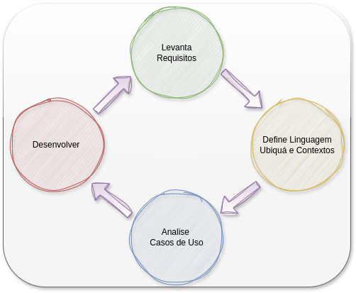

# Definição

Desenvolver um software eficiente e de alta qualidade é uma tarefa complexa que exige uma abordagem estruturada e bem planejada. Para isso, é essencial seguir uma metodologia que ajude a equipe de desenvolvimento a compreender as necessidades do cliente, definir conceitos de negócios essenciais e criar uma base sólida para o desenvolvimento. Nesse contexto, nossa metodologia de desenvolvimento de software está dividida em algumas etapas cruciais para o sucesso do projeto.

  

## Etapa 1: Levantamento de Requisitos

A primeira etapa do processo é o levantamento de requisitos. Aqui, trabalhamos em estreita ***colaboração com o cliente*** para entender suas necessidades. Isso envolve a identificação de ***requisitos funcionais*** (o que o software deve fazer) e ***requisitos não funcionais*** (como o software deve funcionar). Este é o estágio em que construímos a base do projeto, entendendo completamente as expectativas e os objetivos do cliente.

- [Mais...](7-meto-etapa-1.md)

## Etapa 2: Definição de Linguagem Ubíqua e Contextos de Negócio

Uma vez que tenhamos uma compreensão clara dos requisitos, avançamos para a segunda etapa, que é a definição de uma "linguagem ubíqua" em conjunto com o cliente. Isso envolve a criação de um conjunto de conceitos e terminologias que todos na equipe e no cliente compreendem claramente. Além disso, exploramos o negócio em profundidade, distinguindo entre o que é considerado o "***core***" (a parte mais essencial do serviço) e os "***contextos auxiliares***" (aquilo que auxilia o core a atingir seus objetivos). Isso é crucial para alinhar as expectativas,focar no que realmente importa e na identificação de possiveis serviços da applicação.

- [Mais...](7-meto-etapa-2.md)

## Etapa 3: Análise de Casos de Uso

Na terceira etapa, nos concentramos na análise de casos de uso da aplicação. Isso significa que examinamos em detalhes quais ações a aplicação deve realizar. Essa análise envolve a compreensão das diferentes funcionalidades que o software deve oferecer e como ele será usado pelos usuários. É uma fase de refinamento onde traduzimos os requisitos em cenários de uso práticos.

- [Mais...](7-meto-etapa-3.md)

## Etapa 4: Desenvolvimento

Finalmente, chegamos à quarta etapa, onde iniciamos o desenvolvimento do software com base nos casos de uso identificados e nos conceitos estabelecidos. Nesta fase, é essencial seguir uma [arquitetura padrão](8-definicao_arq.md) previamente definida para garantir consistência e eficiência no desenvolvimento. Isso inclui a seleção de tecnologias, a estruturação do código e a implementação das funcionalidades de acordo com as especificações previamente estabelecidas.

- [Mais...](7-meto-etapa-4.md)

## Conclusão 

O processo de desenvolvimento se baseia em entregas contínuas com entregáveis alinhados com o cliente, que possuem valor de negócio para ele. Isso significa que ao longo de todo o projeto, estamos entregando partes do software que o cliente pode testar e usar, permitindo ajustes e refinamentos conforme necessário. Todas as etapas são reavaliadas continuamente para garantir que estamos sempre no caminho certo, alinhados com as necessidades e expectativas do cliente.

Essa abordagem resulta em uma documentação viva e colaborativa que envolve todos os stakeholders do projeto. A colaboração contínua com o cliente, juntamente com a entrega iterativa, nos ajuda a criar um software de alta qualidade, reduzindo riscos, economizando tempo e recursos, e garantindo que o cliente esteja sempre no controle do processo de desenvolvimento.

- [Voltar](README.md)