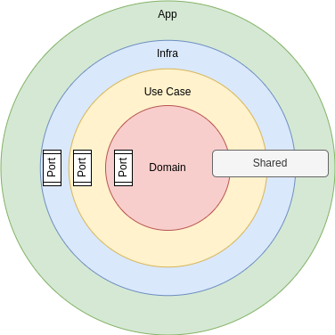

# Definição

A arquitetura aqui proposta é fortemente influenciada por princípios derivados de duas abordagens arquiteturais distintas: a Arquitetura Limpa e a Arquitetura Hexagonal, alem de Domain-Driven Design (DDD). Essas influências combinam-se para criar um sistema que é modular, desacoplado, altamente testável e orientado pelo domínio.

## Influência da Arquitetura Limpa

A Arquitetura Limpa, proposta por Robert C. Martin, estabelece a separação de preocupações em camadas bem definidas e a dependência unidirecional entre essas camadas. Isso promove a manutenibilidade, flexibilidade e escalabilidade do sistema. Nossa arquitetura adota os seguintes princípios da Arquitetura Limpa:

- Separação de Camadas: O sistema é dividido em camadas bem definidas, cada uma com uma responsabilidade específica. As camadas incluem a camada de domínio, a camada de aplicação,a camada de Infraestrutura e camada de Use Cases.

- Independência de Frameworks e Detalhes de Implementação: A camada de domínio é totalmente independente de frameworks e detalhes de implementação, permitindo que seja reutilizável e portável.

- Mapeamento de Casos de Uso: Os Casos de Uso são mapeados para componentes na arquitetura, garantindo que as funcionalidades do sistema estejam claramente definidas e relacionadas com a arquitetura.

## Influência da Arquitetura Hexagonal

A Arquitetura Hexagonal, também conhecida como Ports and Adapters, enfatiza a separação das preocupações do núcleo da aplicação e as interações com o mundo externo. Ela introduz o conceito de portas (interfaces) e adaptadores para facilitar a comunicação entre o sistema interno e externo. Nossa arquitetura incorpora as seguintes características da Arquitetura Hexagonal:

- Portas e Adaptadores: As portas (interfaces) definem os contratos para a interação com o sistema, enquanto os adaptadores implementam essas portas para conectar o sistema a recursos externos, como bancos de dados, filas e serviços externos.

- Isolamento do Domínio: A camada de domínio é o núcleo da lógica de negócios, isolada de preocupações externas. Ela define entidades, agregados e regras de negócios, garantindo que o domínio seja puro e independente de considerações externas.

## Influência do Domain-Driven Design (DDD)

O Domain-Driven Design (DDD) é uma abordagem que coloca o domínio de negócios no centro do desenvolvimento de software. Ele promove a modelagem rica do domínio e o uso de linguagem ubíqua para garantir que a implementação do sistema reflita com precisão o mundo real. Nossa arquitetura incorpora os seguintes princípios do DDD:

- Modelagem do Domínio: A camada de domínio é responsável por modelar conceitos do mundo real, incluindo entidades, agregados e objetos de valor, refletindo fielmente o domínio de negócios.

- Regras de Negócios Centrais: As regras de negócios essenciais são encapsuladas na camada de domínio, garantindo que a lógica de negócios seja o foco central do sistema.

## A arquitetura proposta é composta por quatro camadas interconectadas:

### Camada de Aplicação:
Esta camada representa a interface direta do sistema com os usuários finais. É responsável por receber as solicitações dos clientes, processá-las e fornecer respostas. Ela atua como um intermediário entre os usuários e as funcionalidades do sistema. Quando uma solicitação é recebida, a Camada de Aplicação a encaminha para a Camada de Casos de Uso, iniciando o fluxo de negócios.

- [Mais...](2-application.md)

### Camada de Casos de Uso:
Nesta camada reside o cerne do fluxo do negócios. Ela coordena as operações do sistema, mapeando os diferentes casos de uso. Cada caso de uso representa uma funcionalidade específica do sistema e define como essa funcionalidade é executada. A Camada de Casos de Uso interage com a Camada de Domínio para aplicar as regras de negócios, assegurando que as operações do sistema sejam realizadas de acordo com as necessidades do domínio de negócios. Em conjunto com as outras camadas, essa estrutura oferece modularidade, clareza na separação de responsabilidades e adaptabilidade, tornando o sistema apto a evoluir e escalar de forma eficiente.

- [Mais...](3-use_case.md)

## Camada de Infraestrutura:
A Camada de Infraestrutura é responsável por facilitar a comunicação do sistema com o mundo exterior. Ela lida com a implementação de adaptadores para interfaces externas, garantindo que o sistema possa se integrar de maneira eficiente com diversos recursos externos, como bancos de dados, serviços de terceiros e sistemas legados. Essa camada trata de detalhes técnicos, como persistência de dados, autenticação e protocolos de comunicação.

- [Mais...](4-infra.md)

## Camada de Domínio:
Na Camada de Domínio, residem as regras de negócios centrais e a modelagem do domínio do sistema. Ela é responsável por definir entidades, agregados e objetos de valor que representam conceitos do mundo real. Garante que as operações do sistema estejam alinhadas com o domínio de negócios, mantendo a integridade e a consistência dos dados. A Camada de Domínio coloca o foco central no coração do sistema, garantindo que a implementação reflita com precisão o mundo real e as necessidades do negócio. 

- [Mais...](5-domain.md)

  

## Obs:

### Componente Shared
Embora o Componente Shared não seja considerado uma camada distinta, desempenha um papel fundamental na arquitetura, abrigando recursos compartilhados usados tanto pela Camada de Aplicação quanto pela Camada de Infraestrutura com Adapters. Este componente é o ponto central onde funcionalidades comuns, como autenticação, logging, gerenciamento de exceções e utilitários, são centralizados para promover a reutilização de código e a consistência em todo o sistema. Ele atua como um facilitador para garantir que os módulos de aplicação e os adaptadores possam acessar funcionalidades essenciais de maneira consistente, mantendo a integridade e eficiência do sistema. Embora não seja uma camada em si, o Componente Shared desempenha um papel crítico na criação de uma arquitetura organizada e coesa.

- [Mais...](9-shared.md)

## Conclusão

Em resumo, a arquitetura baseada nessas influências busca criar um sistema que seja modular, desacoplado, com um domínio bem modelado e uma clara separação de responsabilidades entre suas camadas. Isso resulta em um software altamente flexível, testável e alinhado com as necessidades do negócio, garantindo que as preocupações de infraestrutura e detalhes de implementação sejam isoladas das regras de negócios centrais.

- [Voltar](README.md)