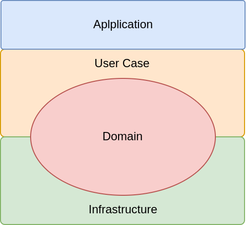

# Definição

A arquitetura aqui proposta é fortemente influenciada por princípios derivados de duas abordagens arquiteturais distintas: a Arquitetura Limpa e a Arquitetura Hexagonal, alem de Domain-Driven Design (DDD). Essas influências combinam-se para criar um sistema que é modular, desacoplado, altamente testável e orientado pelo domínio.

## Influência da Arquitetura Limpa

A Arquitetura Limpa, proposta por Robert C. Martin, estabelece a separação de preocupações em camadas bem definidas e a dependência unidirecional entre essas camadas. Isso promove a manutenibilidade, flexibilidade e escalabilidade do sistema. Nossa arquitetura adota os seguintes princípios da Arquitetura Limpa:

- Separação de Camadas: O sistema é dividido em camadas bem definidas, cada uma com uma responsabilidade específica. As camadas incluem a camada de domínio, a camada de aplicação,a camada de Infraestrutura e camada de Use Cases.

- Independência de Frameworks e Detalhes de Implementação: A camada de domínio é totalmente independente de frameworks e detalhes de implementação, permitindo que seja reutilizável e portável.

## Influência da Arquitetura Hexagonal

A Arquitetura Hexagonal, também conhecida como Ports and Adapters, enfatiza a separação das preocupações do núcleo da aplicação e as interações com o mundo externo. Ela introduz o conceito de portas (interfaces) e adaptadores para facilitar a comunicação entre o sistema interno e externo. Nossa arquitetura incorpora as seguintes características da Arquitetura Hexagonal:

- Portas e Adaptadores: As portas (interfaces) definem os contratos para a interação com o sistema, enquanto os adaptadores implementam essas portas para conectar o sistema a recursos externos, como bancos de dados, filas e serviços externos.

- Isolamento do Domínio: A camada de domínio é o núcleo da lógica de negócios, isolada de preocupações externas. Ela define entidades, agregados e regras de negócios, garantindo que o domínio seja puro e independente de considerações externas.

## Influência do Domain-Driven Design (DDD)

O Domain-Driven Design (DDD) é uma abordagem que coloca o domínio de negócios no centro do desenvolvimento de software. Ele promove a modelagem rica do domínio e o uso de linguagem ubíqua para garantir que a implementação do sistema reflita com precisão o mundo real. Nossa arquitetura incorpora os seguintes princípios do DDD:

- Modelagem do Domínio: A camada de domínio é responsável por modelar conceitos do mundo real, incluindo entidades, agregados e objetos de valor, refletindo fielmente o domínio de negócios.

- Regras de Negócios Centrais: As regras de negócios essenciais são encapsuladas na camada de domínio, garantindo que a lógica de negócios seja o foco central do sistema.

## Conclusão

Em resumo, a arquitetura baseada nessas influências busca criar um sistema que seja modular, desacoplado, com um domínio bem modelado e uma clara separação de responsabilidades entre suas camadas. Isso resulta em um software altamente flexível, testável e alinhado com as necessidades do negócio, garantindo que as preocupações de infraestrutura e detalhes de implementação sejam isoladas das regras de negócios centrais.

A arquitetura proposta possui quatro camadas principais: a Camada de Aplicação, responsável pela interação com os clientes; a Camada de Casos de Uso, que contém o fluxo do negócio; a Camada de Infraestrutura, que facilita a comunicação com o mundo externo; e a Camada de Domínio, onde as regras de negócios centrais e a modelagem de domínio são definidas. Essas camadas colaboram para criar um sistema modular, bem organizado e altamente adaptável, promovendo a clareza na separação de responsabilidades e facilitando a manutenção e escalabilidade do sistema.

  

