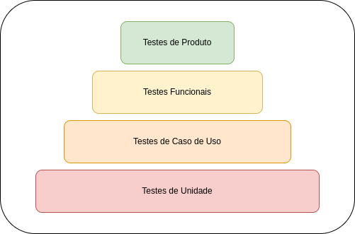

## Introdução

A qualidade no desenvolvimento de software é um aspecto fundamental para garantir a satisfação do cliente, a confiabilidade do produto e a eficiência operacional. Em um ambiente cada vez mais competitivo e exigente, a qualidade torna-se um diferencial crucial para o sucesso de um projeto de software. Ela abrange diversos aspectos, desde a correção e confiabilidade do código até a adequação às necessidades e expectativas do usuário final.

## Objetivo

Nosso objetivo é assegurar a qualidade em todas as entregas de nosso projeto de software, utilizando quatro níveis de testes estrategicamente distribuídos ao longo do ciclo de desenvolvimento. Cada nível de teste possui um propósito específico, permitindo uma abordagem abrangente para garantir a qualidade em diferentes aspectos do produto.

  

### Descrição dos Níveis de Testes:

1. **Testes de Unidade:**

   Os testes de unidade são responsáveis por validar individualmente partes específicas do código-fonte. Eles são executados em unidades isoladas, como funções, métodos ou classes, e têm como objetivo principal verificar se essas unidades funcionam conforme o esperado. Devido ao seu escopo restrito, os testes de unidade são altamente eficientes na detecção precoce de erros e na garantia da qualidade do código. Eles são executados em grande quantidade devido ao seu baixo custo de implementação e manutenção.

2. **Testes de Casos de Uso:**

   Os testes de casos de uso têm como objetivo validar o fluxo de negócios, garantindo que as funcionalidades principais atendam aos requisitos e expectativas do usuário final. Eles são realizados utilizando mocks ou simulações para isolar o caso de uso em teste, permitindo validar o comportamento sem depender diretamente de suas dependências externas. O foco está na verificação da lógica de negócios e na garantia de que as interações com outras partes ocorram conforme o esperado.

3. **Testes Funcionais:**

   Os testes funcionais visam validar a funcionalidade geral do serviço, garantindo que ele atenda aos requisitos de negócios e às expectativas do usuário final. Eles se concentram na verificação das interfaces de usuário, APIs e integrações externas, garantindo que todas as funcionalidades estejam operando corretamente. No caso de serviços que disponibilizam APIs, os testes funcionais incluem a verificação das chamadas de API em conformidade com as regras de negócios definidas para o serviço.

4. **Testes do Produto:**

   Os testes do produto são responsáveis por validar a integração e interação entre todos os serviços e componentes que compõem o produto final. Eles garantem que o sistema como um todo funcione de maneira adequada e atenda aos requisitos e expectativas globais do usuário. Embora em menor quantidade em comparação com os testes de unidades e casos de uso, os testes do produto são essenciais para garantir a funcionalidade completa e a qualidade geral do produto entregue.

Esses diferentes níveis de testes combinados oferecem uma abordagem abrangente para garantir a qualidade em todas as etapas do desenvolvimento de software, desde o nível mais granular do código até a validação do produto final. Ao adotar essa estratégia, podemos identificar e corrigir problemas precocemente, garantindo entregas confiáveis e satisfatórias para nossos clientes.
